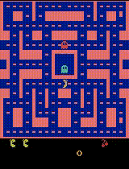

# RAINBOW IS ALL WE NEED 🌈
[](https://pypi.org/project/gymnasium/0.29.1/)
[](https://pypi.org/project/numpy/1.26.3/)
[](https://pypi.org/project/opencv-python/4.9.0.80/)
[](https://pypi.org/project/torch/2.1.2/)

## Description
This project implements the Rainbow Deep Reinforcement Learning (DRL) algorithm, a state-of-the-art technique that combines several advancements in the field of reinforcement learning to achieve superior performance in a wide range of environments. Rainbow integrates multiple key innovations, including Double Q-learning, prioritized experience replay, dueling network architectures, multi-step learning, distributional reinforcement learning, and noisy nets, into a single, cohesive agent.

## Getting started 🚀

To get started with this project, follow these steps to install the necessary dependencies. It is recommended to use a virtual environment to manage dependencies separately from your system's Python installation.

1. **Clone the repository**

    ```bash
    git clone https://github.com/Manuelnkegoum-8/Rainbow_is_all_we_need.git
    cd your-project
    ```

2. **Set up a virtual environment** (optional but recommended)

    - For Unix/Linux or MacOS:

        ```bash
        python3 -m venv venv
        source venv/bin/activate
        ```

    - For Windows:

        ```bash
        python -m venv venv
        .\venv\Scripts\activate
        ```

3. **Install the requirements**

    ```bash
    pip install -r requirements.txt
    ```

4. **Usage**

    - To run the training module with custom configurations, use the following command format. This example sets the game to "SpaceInvadersNoFrameskip-v4," the number of steps to 5 million, and the memory capacity to 100,000.

```
python  trainer.py --game SpaceInvaders --steps 5e6 --memory_capacity 1e5
```

## Results 📊



## Acknowledgements  🙏 

- Thanks to the creators of the Rainbow algorithm and all the researchers whose work contributed to this powerful approach to deep reinforcement learning.
- Special thanks to [OpenAI](https://openai.com/) for providing the baseline wrappers for Atari environments, which significantly simplify the process of preprocessing and setting up these environments for training.
- This project uses [OpenAI Gym](https://gym.openai.com/) for the environment simulations.

## Authors  🧑‍💻
- Victor Hoffmann 
- Manuel Nkegoum


## References 📄 
[1] [Rainbow: Combining Improvements in Deep Reinforcement Learning](https://arxiv.org/abs/1710.02298)  
[2] [Distributional Reinforcement Learning with Quantile Regression](https://arxiv.org/abs/1710.10044)  
[3] [Playing Atari with Deep Reinforcement Learning](http://arxiv.org/abs/1312.5602)  
[4] [Deep Reinforcement Learning with Double Q-learning](http://arxiv.org/abs/1509.06461)  
[5] [Prioritized Experience Replay](http://arxiv.org/abs/1511.05952)  
[6] [Dueling Network Architectures for Deep Reinforcement Learning](http://arxiv.org/abs/1511.06581)  
[7] [Reinforcement Learning: An Introduction](http://www.incompleteideas.net/sutton/book/ebook/the-book.html)  
[8] [A Distributional Perspective on Reinforcement Learning](https://arxiv.org/abs/1707.06887)  
[9] [Noisy Networks for Exploration](https://arxiv.org/abs/1706.10295)
